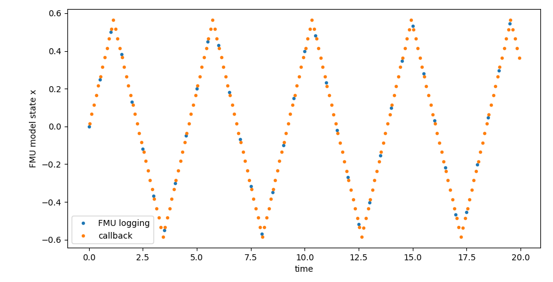

# Examples: FMU-attached Devices for Hypatia

## About

Examples for running Hypatia with [ns-3](https://www.nsnam.org/) application layer models that use a [Functional Mock-up Unit](https://fmi-standard.org/) (FMU) for Co-Simulation (FMI 2.0) to compute its internal state.
This package is primarily intended to work with the ns-3 simulator provided by the [Hpyatia](https://github.com/snkas/hypatia) simulator.
However, it can also be used with standard ns-3 distrubtions.

## Prerequisites

1. Start from a [clean Hypatia installation](https://github.com/snkas/hypatia?tab=readme-ov-file#getting-started).
2. Install the module for [FMU-attached Devices for Hypatia](https://github.com/AIT-IES/hypatia-fmu-attached-device?tab=readme-ov-file#quick-start-ubuntu-2004)

## Run the Examples

### Simple Example: Echo

In this example, a client sends data to an FMU-attached device via a LEO network and awaits the response.
The behavior of the client and the FMU-attached device is implemented via simple callbask functions.
When running the simulation, you should see log messages similar to the following:

```
[Device 1252] received message: Hello from client 1170 to device 1252!
[Client 1170] Receieved message from device 1252: Value of 'x' is 0.0316975
```

The config files for running the example are in folder [`demo_run_dir`](./demo_run_dir/).
The sources for the main executable are in folder [`src/main_satnet_cosim_echo`](./src/main_satnet_cosim_echo)
The results from the simulation (log files, CSV output from FMU) will be written to folder `demo_run_dir/logs_ns3`

Run the example from the command line:
``` bash 
./main_satnet_cosim_echo <hypatia-root-dir>"
```

**NOTE**: The path to the Hypatia root directory can be relative to the current working directory or absolute

### Simple Example: Controller

In this example, a client uses a simple hysteresis controller to control the state of an FMU-attached device via a LEO network.
The behavior of the client and the FMU-attached device is implemented via dedicated classes (`DeviceController` and `DeviceLogic`).
Both the client and the device use XML-formatted messages for communication.



The config files for running the example are in folder [`demo_run_dir`](./demo_run_dir/).
The sources for the main executable are in folder [`src/main_satnet_cosim_ctrl`](./src/main_satnet_cosim_ctrl)
The results from the simulation (log files, CSV output from FMU and controller) will be written to folder `demo_run_dir/logs_ns3`

Run the example from the command line:
``` bash 
./main_satnet_cosim_ctrl <hypatia-root-dir>"
```

**NOTE**: The path to the Hypatia root directory can be relative to the current working directory or absolute
